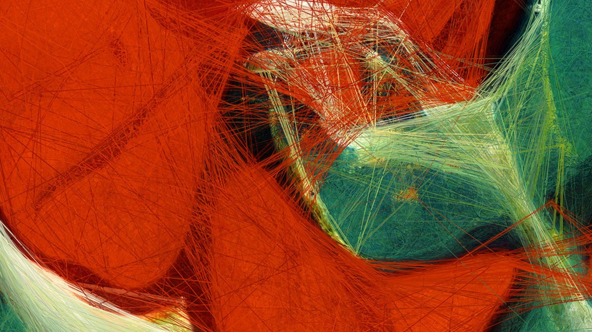
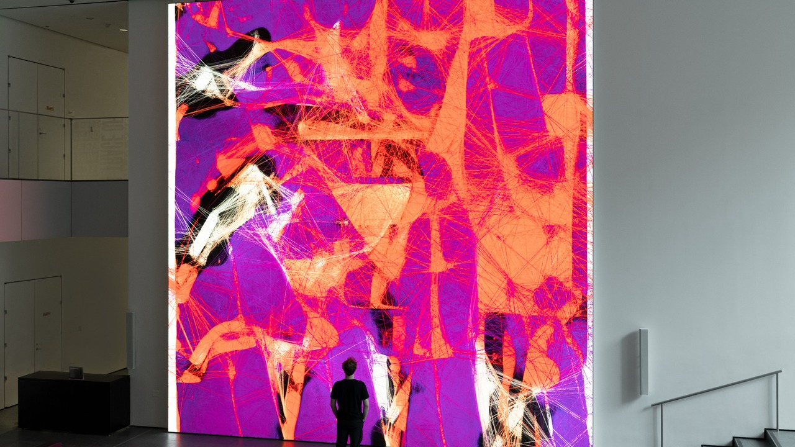
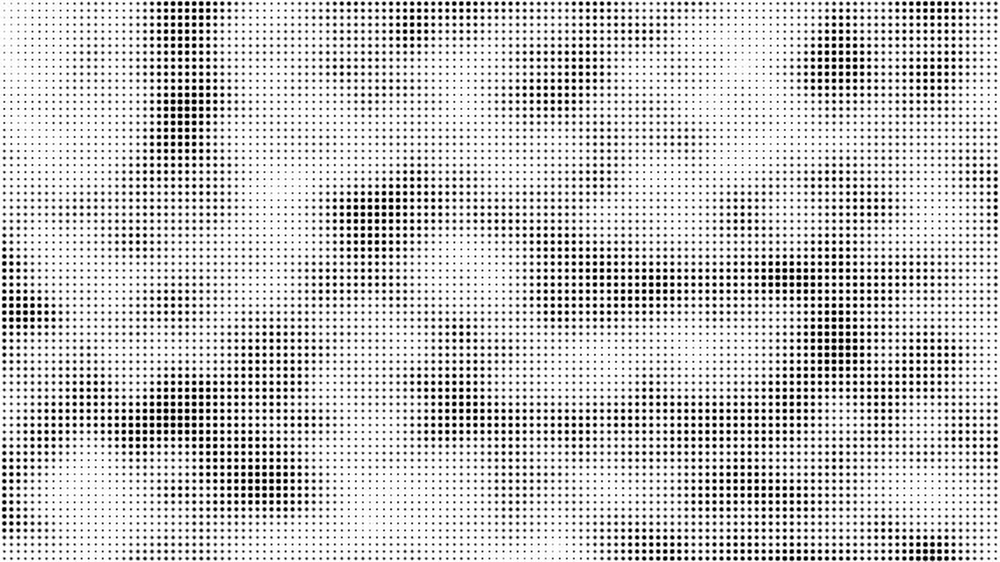
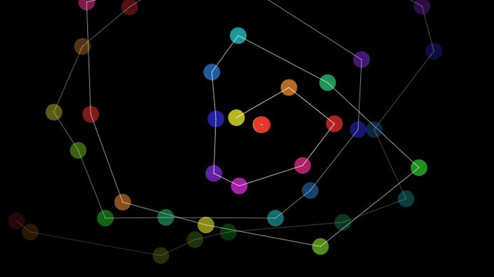

# xzha0846_9103_tut05
# Quiz 8 — Design Research for Major Assignment

> This README presents my early design research for the final assignment.  
> My direction focuses on generative visuals that can respond to user input, time, noise and audio.

---

## Part 1: Imaging Technique Inspiration

### Chosen Imaging Technique

**Fluid Particle Dynamics in Generative Digital Art**

**Inspiration source:** *Unsupervised — Machine Hallucinations — MoMA* (2021–2022) by **Refik Anadol**  
**Medium:** Real-time generative AI, large-scale LED installation  
**Venue:** The Museum of Modern Art (MoMA), New York  
**Official source:** [moma.org — Refik Anadol: Unsupervised](https://www.moma.org/calendar/exhibitions/5535)

---

### Reference Images

**Image 1 — Data Visualisation Detail: flowing particle lines from *Unsupervised***

  

  <em>Detail from <strong>Unsupervised — Machine Hallucinations — MoMA</strong> (2021–2022), Refik Anadol. The image shows thousands of generative particle lines forming organic, wave-like clusters. The AI model continuously re-generates new colour combinations from MoMA's 138,151-work archive in real time. 
  Source: <a href="https://refikanadol.com/works/unsupervised/">refikanadol.com/works/unsupervised</a></em>

---

**Image 2 — Installation View at MoMA: full scale of the work in the Gund Lobby**

  

  <em>Installation view of <strong>Unsupervised</strong> at The Museum of Modern Art, New York, November 2022 – October 2023. The 24-foot square LED screen continuously generates new visual forms in the lobby, responding to environmental input including light, movement, and acoustics. 
  Source: <a href="https://www.moma.org/calendar/exhibitions/5535">moma.org/calendar/exhibitions/5535</a></em>

---

### Why I Selected This Example

I selected Unsupervised because it shows a clear visual technique. I want to learn that particles moving together to create a flowing and animated image on screen. The first image shows the fine detail of those particle lines up close and the second shows how powerful this looks at a large scale. Both together help explain what I am aiming for a visual that feels alive and responds to interaction.

---

### Discussion

*Unsupervised* by Refik Anadol uses thousands of particles that flow and change colour continuously on screen. I want to bring this idea of smooth, moving particles into my own project. Instead of using AI data like Anadol does, I plan to drive the particle movement with user input — such as mouse position, audio or time. This technique lets the assignment well because it creates a visually interesting result without needing complex code. The basic idea of particles following a direction and leaving trails is something achievable in p5.js at a starter level.

---

---

## Part 2: Coding Technique Exploration

### Chosen Coding Technique

**Perlin Noise Flow Field with Particle System in p5.js**

**Reference:** *Coding Challenge #24: Perlin Noise Flow Field* — The Coding Train (Daniel Shiffman)  
**Source:** [thecodingtrain.com/challenges/24-perlin-noise-flow-field](https://thecodingtrain.com/challenges/24-perlin-noise-flow-field/)

---

### Coding Technique in Action

**Screenshot 1 — p5.js Noise: organic dot texture generated from Perlin noise values**

  

  <em>p5.js <strong>Noise</strong> example — dots are sized by Perlin <code>noise()</code> values, producing a smooth, organic texture. This is the same underlying function used to steer particle direction in a flow field. 
  Source: <a href="https://p5js.org/examples/repetition-noise/">p5js.org/examples/repetition-noise</a></em>

---

**Screenshot 2 — p5.js Connected Particles: interactive particle and line system driven by mouse input**

  

  <em>p5.js <strong>Connected Particles</strong> example — a particle class creates coloured circles and connecting lines as the user moves their mouse. This shows the particle system structure that combines with Perlin noise to produce the fluid motion seen in Anadol's work. 
  Source: <a href="https://p5js.org/examples/classes-and-objects-connected-particles/">p5js.org/examples/classes-and-objects-connected-particles</a></em>

---

### Discussion

In p5.js, the `noise()` function produces smooth and gradually changing values. I can use these values to set the direction each particle moves each frame, so every particle follows a slightly different curved path — similar to the flowing lines in Anadol's work. The mouse position or audio level can shift the noise values so the visual reacts to input. This technique helps me achieve the effect from Part 1 because it controls the organic movement automatically and it works inside the standard p5.js `draw()` loop without needing any extra libraries.

---

### Example Implementation and Code Links

| Resource | Link |
|---|---|
| 📺 Tutorial — The Coding Train: Perlin Noise Flow Field | [thecodingtrain.com/challenges/24-perlin-noise-flow-field](https://thecodingtrain.com/challenges/24-perlin-noise-flow-field/) |
| 💻 Example code — p5.js Web Editor (live sketch) | [editor.p5js.org/codingtrain/sketches/gnwKoGMHT](https://editor.p5js.org/codingtrain/sketches/gnwKoGMHT) |
| 📖 p5.js reference — `noise()` function | [p5js.org/reference/p5/noise](https://p5js.org/reference/p5/noise/) |
| 📦 Supporting example — p5.js Noise | [p5js.org/examples/repetition-noise](https://p5js.org/examples/repetition-noise/) |
| 📦 Supporting code — p5.js Noise on GitHub | [github.com — p5.js-example / Noise / code.js](https://github.com/processing/p5.js-example/blob/main/examples/07_Repetition/04_Noise/code.js) |
